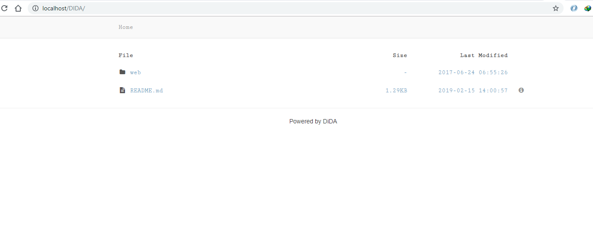

- DIDA -

Introduction
------------

DIDA is a simple PHP script that lists the contents of any web-accessable directory and
allows navigating there within. Simply upload DIDA to any directory and get immediate
access to all files and sub-direcories under that directory. DIDA is written in PHP and
distributed under the [MIT License](http://www.opensource.org/licenses/mit-license.php).

Features
--------

  * Extremely simple installation
  * Creates on-the-fly listing of any web-accessable directory
  * Custimizable sort order of files/folders
  * Easily define hidden files to be excluded from the listing

Requirements
------------

DIDA requires PHP 5.3+ to work properly.  For more information on PHP, please visit
<http://www.php.net>.

Installation
------------

  1. Copy `resources/default.config.php` to `resources/config.php`
  2. Upload `index.php` and the `resources` folder to the folder you want listed
  3. Upload additional files to the same directory as index.php

Render
------------

Troubleshooting
---------------

Ensure you have the latest version of DIDA installed.
Verify that you have PHP 5.3 or later installed. You can verify your PHP version by running:

    php --version

License
-------

DIDA is distributed under the terms of the
[MIT License](http://www.opensource.org/licenses/mit-license.php).
